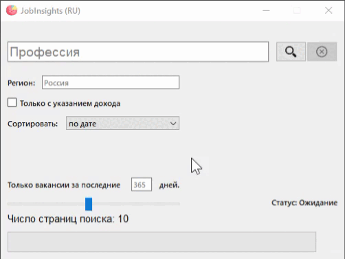
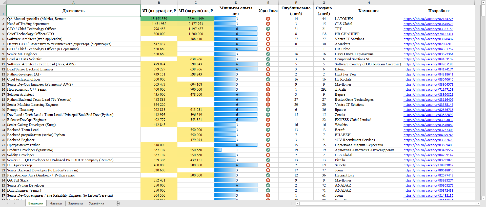
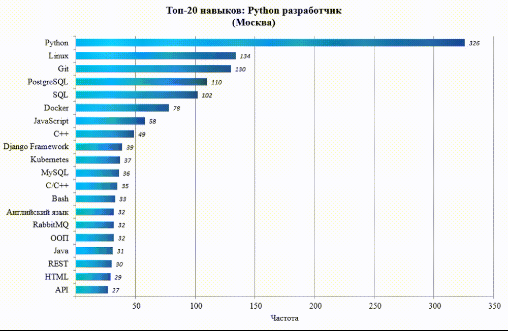

# Job Insights
**Job Insights** - это утилита-сервис аналитики платформы HeadHunter.ru

## А как работает ?
Введите запрос и нажмите пару волшебных кнопок, в результате Вы получите xlsx-файл,  
в котором в виде таблиц и диаграмм будет находиться интересующая Вас информация.  
Это быстро, просто, удобно, а ещё позволяет получить данные, которые не указаны явно на самой платформе.

## Сценарии использования
* Парсинг свежих вакансий (актуально соискателям).
* Получение статистических (и не только) данных о конкретной профессии (для тех, кто задумывается о смене рода деятельности).
* Сравнительный анализ нескольких профессий по различным критериям (подойдёт аналитикам, писателям статей и просто любителям посравнивать).
* Данные о наиболее востребованных навыках (тем, кто хотел бы подтянуть скиллы в нужной области).

## Что важно знать
Обязательно прочитайте нижесказанное:
* Для хранения и записи данных используется новый формат Excel - xlsx. Поэтому Вам потребуется MS Excel версии не ниже 10.
* Перед выполнением нового поиска рекомендуется закрыть другие Excel файлы.
* Рекомендуемое число анализируемых страниц - 10, то есть 1000 вакансий. (Но можно догнать и до 20)
* Поиск может быть прерван со стороны hh.ru, но происходит это редко. В данном случае файл будет экстренно сохранён с текущим содержимым.
* Анализ 1000 вакансий займёт 6-7 минут.
* Все показатели дохода сводятся к состоянию на "После уплаты налогов". (Только для РФ)
* После статус-строки "Файл закрыт" в директории появится xlsx с нашим запросом.

## Возможности

Коротко пройдёмся по возможностям JobInsights:
* Как только Вы сделали первый запрос, у Вас будет создана директория **Мои запросы**, в которую будут собираться все файлы запросов.
* Главную таблицу Вы можете сортировать по интересующим Вас столбцам. (Это правда удобно)
* Парсер тестировался на различных запросах. (Но если вы нашли ошибку, сделайте Pull-request с её описанием)
* Вся визуальная часть автоматически оформляется в среде MS Office, поэтому пользователь без труда сможет поменять оформление.
* Также можно наблюдать первичные даты создания объявлений. (Это круто, ведь возможно с ними что-то не так, если они висят по 666 дней...)
* Каждая запись таблицы сопровождается кликабельной URL на вакансию. (Показалось интересным? Жми!)

## Установка и запуск
1. cd ./Desktop/
2. git clone https://github.com/SIGBREAK/JobInsights.git
3. pip install -r requirements.txt
4. Запуск через ***main.py***

! Или скачать репозиторий архивом и воспользоваться <a href="https://www.dropbox.com/scl/fo/hvcmv3b0bpvjpigf0cabo/h?rlkey=m92yls8ab7wjh5jyp2kbfkos2&dl=0">portable</a>.

## Системные требования
Проверено на конфигурации: Win 10, Python 3.10, MS Office 16.

## Присоединяйтесь!
Если Вам нравится этот проект и вы хотите присоединиться к его разработке, буду рад видеть Вас в команде!

____

### Автор:
  * Github: [Ananich Roman](https://github.com/SIGBREAK)
  * Telegram: [SIGBREAK](https://t.me/SIGBREAK)

### Релиз:
  * 2023/08/02.

### Лицензия:
  * Apache-2.0 license
